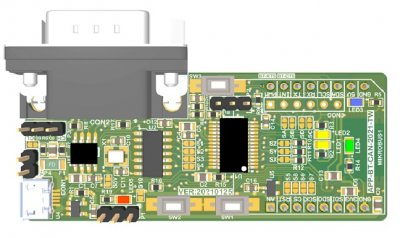

# PIC24F-RN4678-BLE-MCP2518FD-CAN

## Summary

This repository contains a MPLAB X project for the APP_BT_CAN reference design. The reference design demonstrates how to interface the PIC24F MCU Family with an external Bluetooth module and CAN FD controller. This design uses the [PIC24FJ32GU202](https://www.microchip.com/en-us/product/PIC24FJ32GU202) device, this is interfaced to a [RN4678](https://www.microchip.com/en-us/product/RN4678) Bluetooth module and [MCP2518FD](https://www.microchip.com/en-us/product/MCP2518FD) external CAN FD controller using UART and SPI peripheral respectively.

|  |
| :--: |
| *APP_BT_CAN Reference Design* |

### Device Support
*Featured Microchip Technology Products:*
- [PIC24FJ32GU202 Product Website](https://www.microchip.com/PIC24FJ32GU202)
  - [PIC24FJxxGU20x Device Family Data Sheet](https://www.microchip.com/DS30010221)
  - [PIC24FJxxGU20x Device Family Silicon Errata and Data Sheet Clarification](https://www.microchip.com/DS80000929)
- [RN4678 Bluetooth Dual Mode Module](https://www.microchip.com/RN4678)
  - [RN4678 Bluetooth Dual Mode Module Data Sheet](https://www.microchip.com/DS50002519)
- [MCP2518FD External CAN FD Controller with SPI Interface](https://www.microchip.com/MCP2518FD)

## Related Tools
CAN BUS ANALYZER TOOL - Part Number: [APGDT002](https://www.microchip.com/en-us/development-tool/APGDT002)

## Development Tools

##### MPLAB® X Integrated Development Environment (IDE)
  - [Requires MPLAB® X IDE, Version v5.40 or later](https://www.microchip.com/mplabx)
    - [Download latest version of MPLAB® X IDE for Windows](https://www.microchip.com/mplabx-ide-windows-installer)
    - [Download latest version of MPLAB® X IDE for Linux](https://www.microchip.com/mplabx-ide-linux-installer)
    - [Download latest version of MPLAB® X IDE for MAC OS](https://www.microchip.com/mplabx-ide-osx-installer)

##### MPLAB® XC16 C-Compiler
  - [Requires MPLAB® XC16 Compiler, Version v1.50 or later](https://www.microchip.com/xc16)
    - [Download latest version of MPLAB® XC16 Compiler for Windows](https://www.microchip.com/mplabxc16windows)
    - [Download latest version of MPLAB® XC16 Compiler for Linux](https://www.microchip.com/mplabxc16linux)
    - [Download latest version of MPLAB® XC16 Compiler for MAC OS](https://www.microchip.com/mplabxc16osx)
